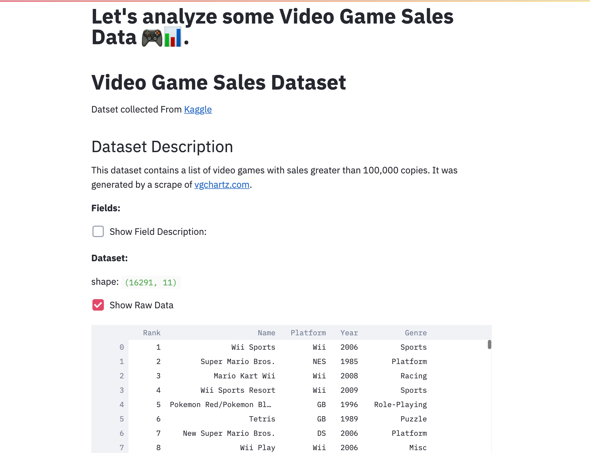

# Project name

TODO: Short abstract describing the main goals and how you achieved them.

## Project Goals

The main question we are enabling the user to answer is: How are the video game preferences in different regions of the world changing over the years? The dataset we use for this project is video game sales, which contains 3 main dimensions: Year, Region, and Sales. We want the user to explore the dataset through several interactive visualizations to figure out the trends, relations, and differences in these 3 dimensions. More specifically, users will be able to answer the following questions:
- What type of games are popular each year (5 years/10 years)?
- What are the highest selling games for each platform/publisher?
- What are the most popular game series?
- What are the most popular game genres?
- Do gamers in different regions enjoy the same types of games?

## Design

1. For yearly sales trend visualization, we choose a line plot and a separate histogram plot for each region with the x-axis representing the years and y-axis representing the sales. The line plot shows the differences in each region as well as the overall sales trend in each region over the years, while the histogram shows more detailed yearly sales information. An alternative visual encoding would be a stacked histogram. This approach, however, cannot effectively encode the sales trend for each specific region. Therefore, we choose a combination of a line plot and a histogram instead.
2. For individual sales data, we choose a scatter plot with an x-axis representing the years and a y-axis representing the sales. We also color the points with grouping information selected by the user (genre, platform, and publisher). There are not many alternatives for this encoding because the number of dimensions involved is quite large (year, sales, group, and region). One possible encoding would be a 3-D scatter plot, but we think it is unnecessarily complicated and might confuse the user. 
3. For encoding different region’s popular game/genre/publisher information, we use separated histograms for different regions. For each histogram, we use the x-axis for game/genre/publisher names and the y-axis for the total sales. We also sort the x-axis in descending order based on sales data. The alternative encoding can be a pie chart. However, histograms can be more effective in showing the difference between each category. We also considered using a stacked histogram instead of individual histograms. However, since different regions can have different top 10 popular games/genres/publishers, it is not possible to use a stacked histogram to encode this information. In order to provide the user with a way to investigate the correlation of popularity across different regions, we also include a few scatter plots that have different regions on the x and y-axis. The users can click on either the bars in the histogram or points in the scatter plot to see other games in its genre. And they can see the title of the game by hovering over the points. To make the user experience more smooth and avoid misclicks, we do not enable zooming and moving on the scatterplots.
4. For popular game genres on each platform, we decide to use a stacked bar chart to make it easy to compare the popularity of genres within the same year as well as other years. The x-axis represents the years and the y-axis represents the sales in millions, while the color encodes the genre information. We also include a breakdown of each regional sale when hovering over each genre. Since the number of platforms is over 10, having them in a column order of individual chart at the same time will make the visualization too clustered and make comparison difficult. Therefore, we chose to have a dropdown menu to let the users choose which platform they want to explore.
5. For top popular games by each publisher, we initially want to have a list view of top games in a time range that the users can select. However, this does not support the process of exploring and in term limits the users' ability in answering the question of which games are the most popular for each publisher. Hence, we decide to adopt a stacked bar chart approach, showing the sales of the top 20 games over a time-series graph, with the x-axis representing the years and the y-axis representing the sales. In addition, the user can also explore the breakdown of regional popularity by hovering over each game.
6. For popular game series, the information was not included in the dataset at the beginning, so we had to perform text processing to find game series information from the game names. Since the number of game series is way over 10, we used a dropdown menu to let the users focus on one particular game series at a time. Each individual visualization is a time-series graph, with the x-axis representing the years and the y-axis representing the sales. We also encode the regional popularity data and genre information for the hovering over interaction.

## Development

We split the work into 2 halves based on the questions to address. Tianyang spent roughly 20 hours working on the first 4 sections: Yearly Sales Trend, Popular Games, Popular Genres, and Popular Publishers. Ziming spent around 20 hours as well working on the 3 sections of interaction across dimensions: Popular game genre on each platform, Popular game by each publisher, Popular game series. Designing the visual encodings and learning about function usages from documentations took the most time. It is difficult to decide the right amount of information to include in the visualizations and interactions. If we put all dimensions such as year, region, type(name, genre, platform, publisher), and sales together and let the user select what dimensions to display, the system might be too complicated. If we display too little information, for example, if we only plot one region at a time, we cannot effectively compare the results against other regions. We found drawing on a blank paper at the beginning really helpful for prototyping. Iteratively trying out different layouts at the beginning helps us decide what the final visualization should look like. This approach let us save more time during implementation. Therefore, the visualization design process took the most time.

